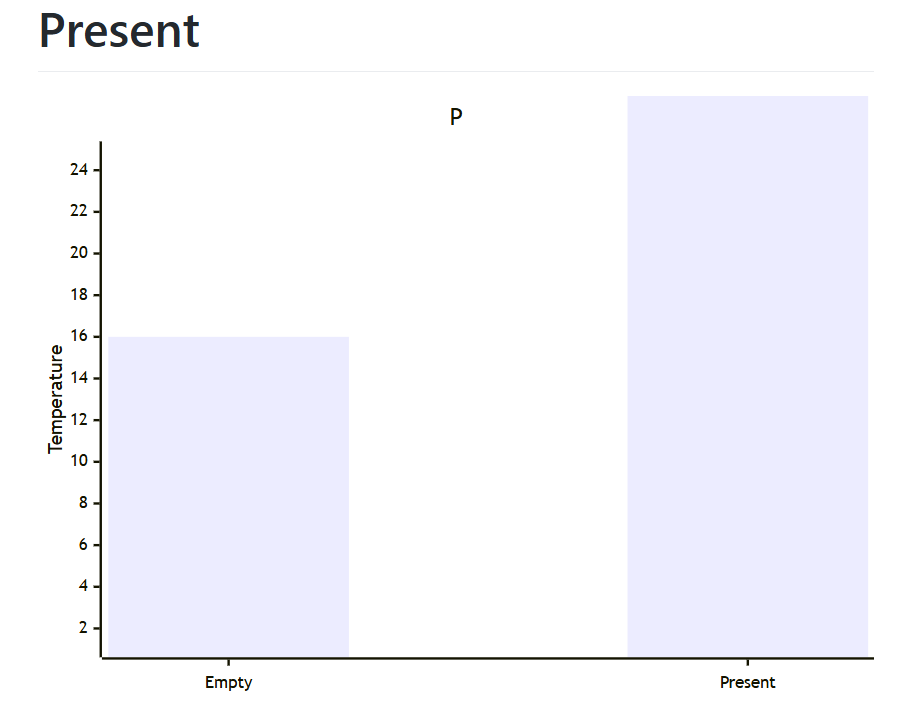
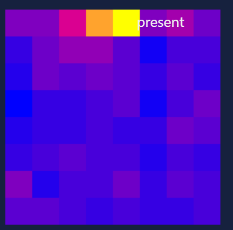
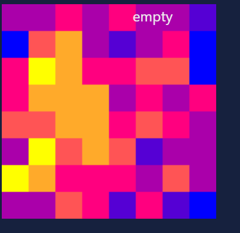
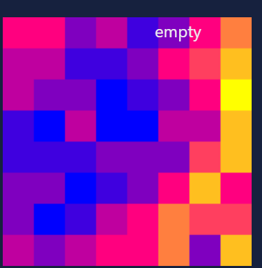

# ANALYSIS

## Question 1
I would say the dataset is balanced, there is an even amount of empty and present frames!
## Question 2

If we assume the temperature threshold is from 16 to 25, then I'd say the threshold is around 20.
## Question 3

These 3 are mislabled because they don't follow that pattern of the present frames having more brighter colors while the empty frames have more cold pixels.

## Question 4

The student with most frames is A18515258. There is then a huge drop off, as the frames go from around 1222 frames to 750 with A18527352 and A18506170. The majority of students however starting from A18520165 to A19107931 have a range of 400-100 frames.